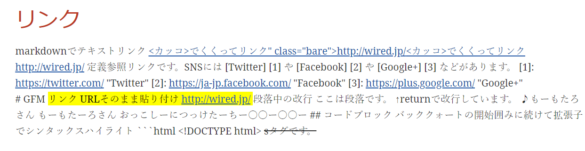

# MarkdownToAsciidoc
Test project for markdown to asciidoc conversion.

マークダウンをAsciidocに変換するにはPandocではなくDocker-AsciidoctorにあるKramdocを使うと良いということを示す。

Kramdocについてはsee [Here](https://matthewsetter.com/technical-documentation/asciidoc/convert-markdown-to-asciidoc-with-kramdoc/).

## Sample markdown

Downloaded from `https://www.dropbox.com/s/4z6kot27jmikhx5/forapp-markdown-sample.md`.

エラーを起こしそうな部分や冗長な箇所は取り除いた。

## Pandoc Command


`--to asciidoctor`が肝要だと思われる。なお，v1.9.11では動かなかった。


```
pandoc sample.md --to asciidoctor -o sample_pandoc.adoc --shift-heading-level-by=-1
```

## Docker-Asciidoctor Command

```
wsl docker run --rm -v $(pwd):/documents/ asciidoctor/docker-asciidoctor kramdoc  --wrap=ventilate --format=GFM sample.md
```

## adoc to html command

- option
  - left toc
  - data-uri
  - asciidoctor-diagram

```
wsl docker run --rm -v $(pwd):/documents/ asciidoctor/docker-asciidoctor asciidoctor <sample.adoc> -r asciidoctor-diagram -a allow-uri-read -a data-uri -a toc=left
```


# Known Problems

試して判明したエラーや知見など。

## PHPのシンタックスハイライトをつけようとするとエラーが出る

xmlのコメントを変換する機能でエラーがでる。以下がそのエラー文。

```
/usr/lib/ruby/gems/2.7.0/gems/kramdown-asciidoc-1.0.1/lib/kramdown-asciidoc/converter.rb:99:in `convert': undefined method `convert_xml_pi' for #<Kramdown::AsciiDoc::Converter:0x0000561a13adec28> (NoMethodError)
Did you mean?  convert_li
```

デバッグの結果以下が原因となった部分。

```php
<?php if (is_tag()){ $posts = query_posts($query_string . '&showposts=20'); } ?>
```

バージョンによっては改善しているかもしれない。

## リンク以降の改行がおかしい

- 定義参照リンク以降の変換がバグる。
  - 定義参照リンクは別口で書くなどして対応するしか？

